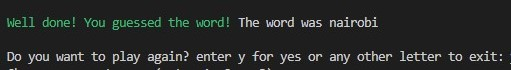

This is a Python terminal game of 'Hangman', deployed to Heroku.

Players must guess a random word, and each wrong guess leads to a part of the man being drawn. If the players guess the word before the whole figure has been displayed, they win. Otherwise, they lose.

The live link to the project is here: https://game-hangman-pp3.herokuapp.com/

## How to play

This game is based on the traditional hangman game:
- Players choose a category for the word
- A random word is chosen and displayed as underscores
- Players are asked to guess a letter
- If their guess is correct, the letter replaces one of the underscores
- If their guess is incorrect, they lose a turn and the figure of the hangman starts to be drawn

If the player guesses the word before their turns go to zero and the full figure is drawn, then the player wins.

If the turns go to zero and the full image of the hangman is drawen, then the player loses.

## Features

The first feature that the user encounters is being asked for their name. The purpose of this is to allow for a more personalized experience. The player will input their name and they will then receive a welcome message. This data entry is validated and it cannot be left blank. Players are free to enter any name they like, even with numbers or characters, however if they leave it blank they will be asked to enter their name again.

The player will then see instructions and rules about the game:

They are informed what the objective of the game is and that they can make a maximun of 10 wrong guesses. They are then introduced to a feature of the game which is categorys. There is a choice of 3 categorys (animals, geography, food): depending on the player choice, the word they have to guess will be related to that category.

This is possible through the use of 3 separate lists of words in the data.py file. Based on the category choice, the random word will be selected from only one of them lists.

After making a selection, users will receive a message which confirms their choice and the game then starts; they are asked to guess a letter and the random word is hidden with underscores. This data is validated and the only acceptable entres are the numbers 1, 2 and 3.

### Guessing a letter

Player can press any letter of the alphabet on their keyboard to start the game. The game is set to recognize both upper and lower case entries. Data is validated, which means that if the player enters a character that is not a letter (for example a number), then they will get a message asking to input a valid character.

If the letter they guess is correct, they receive a message that tells them that the letter chosen is in the word. The underscores in the hidden word then update to show that letter (in it's position in the word). Players also see their 'incorrect guesses left' and letters used. In this case, as the letter was correct, they do not lose a turn.

If the letter guessed is incorrect, players again receive a message, this time stating that the letter is not in the word. The 'incorrect guesses left' diminishes by one and the letter guessed is added to the 'letters tried' list. The image of the hangman also starts to be drawn. As the 'incorrect guesses left' gets lower, a new part of the graphic is added, eventually showing the whole graphic of the hanging man.

### Winning and losing

Players can win the game by guessing all of the letters in the word. When they do this, they receive a message saying that they have guessed the word and won the game. The message also displays the correct word again.

Players lose the game when they run out of incorrect guesses and the full graphic is displayed. In this instance, they receive a message stating that they have lost and showing what the correct word was.

For both instances of winning and losing, the player is asked if they want to play again. They can input y for yes or any other letter to exit.

## Data model

A class called CategoryChoice was used in this game, which has 3 different instances (one for each category). The class has a property of self.category and a method of category_selection, which determines the category to display based on the input of the player. It also displays a message on the terminal to confirm this with the player.

## Data validation

There are multiple times that the player is required to enter an input. For all of these, the data is validated.

- Name request input. 

Input data is validated by a while loop that returns 'please enter a valid name' if the field is left blank. Players are allowed to use numbers and characters in their name, so this only returns an error and does not move forward with the game when it is left blank. Once a valid name is entered, the while loop breaks and the game continues.

- Category selection input. 

Players can only enter in numbers 1, 2 or 3 here. This is validated in the same if statement that assigns a value to 'word' based on the word list selected (if the category is food, the random word will be generated from the food list). This if statement ends with an 'else' (which means that if the selection is not 1, 2 or 3), then a print statement will appear saying to make a valid choice and the options will be presented again. Players cannot continue with the game until they make a valid choice.

- Guessing letters input.

This is validated with the use of a try/except statement. If the player's guess is not in the 'validchoices' set (the alphabet), then this will raise a value error. The value error prints a message informing the player to only enter a letter of the alphabet. This does not impact how far they have gotten in the game already, their already guessed letters will still show and the letters used will still remain the same. They will just need to enter a valid character in order to continue playing.

## Testing

Testing was mainly conducted through the gitpod terminal; as each feature was implemented, the program was run in the terminal and the feature was tested. If it did not work as intended, the code was then worked on again.

The following features were tested:

| Action        | Expected Behaviour  | Result | 
| ------------- | ------------- | ------------- | 
| Run application in terminal  | Message appears and asks for name | pass | 
| Player enters name  | introduction message and category choice appear | pass | 
| Player enters category number  | message confirming category choice appears, game starts | pass | 
| Player enters random character when asked for category  | player is asked to choose again | pass | 
| game starts (after category selection)  | word is displayed as underscores | pass | 
| player enters an uppercase letter  | message says if letter is in the word or not | pass | 
| player enters an lowercase letter  | message says if letter is in the word or not | pass | 
| player enters a letter  | letter is added to 'letters used' list | pass | 
| player enters a number or character  | message says invalid character | pass | 
| letter is correct  | letter replaces underscore | pass | 
| letter is incorrect  | 'incorrect guesses left' decreases by 1 | pass | 
| letter is incorrect  | a piece of the graphic is shown | pass |
| player guesses all letters  | winning message displayed, asked if they want to play again | pass |  
| incorrect guesses left goes to 0  | player told they lost, full graphic drawn, asked if they want to play again | pass |  
| enter 'y' to play again question | game restarts | pass | 
| enter 'n' to play again qustion | game exits | pass | 

Validator testing was done through PEP8 - no errors returned (http://pep8online.com/)

Fixed bugs

There was one known bug which is that when a user selects 'y' to play again, the game does play again as expected, however it automatically starts a new game again at the end of the second game. What should happen is that the player is presented with question if they want to play again. This was fixed by changing the function being called when 'y' was entered to main() instead of the the_game() function. The while loop was also changed to an if statement, which is set to exit if anything other than y is entered.

## Deployment

This project was deployed to Heroku with the following steps:

- create new app

- adding two buildpacks from the _Settings_ tab: `heroku/python`, `heroku/nodejs`
- creating a _Config Var_ called `PORT` and setting this to `8000`
- connected to GitHub repository and deployed

Live link: https://game-hangman-pp3.herokuapp.com/

## Credits

List of random words was generated from: https://www.randomlists.com/random-words